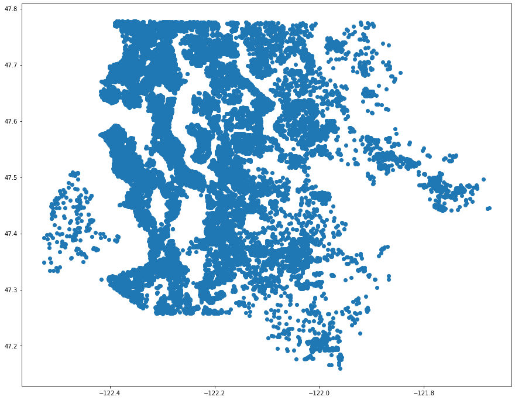

# Aaron Galbraith Flatiron Data Science Phase 2 Project

## Overview

The Hazel Paisley Appraisal Corporation wishes to move into King County, Washington, and offer appraisal services to real estate brokers and private clients in the area for the purposes of advising buyers and sellers on what typical home prices are. We analyzed roughly 30,000 records of home sales from 2021-2022 and constructed a formula to predict home prices based on (1) living area, (2) zip code, (3) view, (4) recent median neighborhood sale price, and (5) whether the property is on the waterfront. Our formula explains 73% of the variation in home prices.

## Business and Data Understanding

### Business Understanding

The Hazel Paisley Appraisal Corporation will benefit from a fast and reliable model. They are unfamiliar with the Seattle metro area and seek to learn what factors matter most in determining home values. As their appraisers become more familiar with the idiosyncracies of the housing market in King County they will add their own nuance to our formula. The purposes of this project will be to highlight the most important factors to include in a simple model that broadly approximates home values and indicates to the Hazel Paisley Appraisal Corporation what data they should focus on to better understand appraisal values in this region.

### Data Understanding
##### Price

Home prices from the initial data set varied from about $27,000 to over $30,000,000. This data skewed right, heavily affected by larger values. The median price was roughly $860,000 while the mean was close to $1,100,000.

##### Geography

We began with 30,155 records and 25 features. The data set supposedly contained records from King County, Washington, but cursory inspection revealed that a few hundred of the records were not even from Washington State. We used the latitude and longitude feature to make scatterplots of the data and further determine which records were in fact inside the boundaries of King County. Then we made some judgment calls to 1) *exclude* some records that were inside King County but clustered in a remote area far from the city of Seattle (and far from the rest of the data) and 2) *include* several records that were technically across the county line but still contiguous with many other records and worthy of comparison and analysis in our project. We dropped 972 records based on geographic location.

The pared down records come from 51 unique cities and 76 zip codes.

##### Dates and Age

All of the records describe details of real estate listings that sold between June 10, 2021 and June 10, 2022. The homes were all built between 1900 and 2022. Only around 1,300 homes had ever been renovated, mostly since the 1980s and most commonly in the last few years before their sales.

##### Area Measurements

Much of the data dealt with area, measured in square feet, of the lot, the living area, the area of the home above grade, the area of the basement, the area of the garage, and the area of the patio.

Like the price, this data mostly skewed right. 

##### Discrete and Categorical Features

The number of bathrooms and bedrooms were given, as were values for the view, grade, and condition of the properties. There were also binary values indicating whether properties were located on a waterfront. There were also values for the type of heat source (gas, oil, electricity, solar) and whether the sewer system was private or public.

#### New Features

We extracted values for the city and zip code for each listing from its address field.

We also created "age" and "years since renovation" from the various associated fields. For homes that had *not* been renovated, their "years since renovation" value was simply the age of the home.

We found average sale prices for each zip code and then grouped the zip codes into 8 "tiers" or "levels".

We created a distance function to generate "neighbor lists" for each listing. The distance function measured distance, in feet, between listings "as the crow flies". Starting with a radius of 250 feet, all the neighbors within that radius were gathered. If the size of this neighbor list did not fall between 15 and 40, then the radius would expand or contract to capture the desired number of neighbors for each listing.

From these neighbor lists, we generated new "nearby" features. Among these was "nearby price". This took the median value of all prices of the neighbors from a neighbor list.

## Modeling

### Baseline

The baseline model accounted for square feet of living area and nothing else.

### Nearby Features

The second model factored in all the median neighborhood value features that were created using the neighbor lists described earlier.

### Log Transformed Features

We attempted to use log transformed features at several stages, but this never improved the overall R^2 value of any model, so we ultimately left all values as they were, without any log transformation.

### Interactions of Features

We explored interactions between the most powerful feature — square feet of living area — and several other features. In the end we saw the most powerful interaction between this living area measurement and two others: waterfront and zip code levels.

## Regression Results

The final model had an R^2 value of 0.730, which means the model can explain 73.0% of the variation in price among the sales analyzed.

We found an RMSE of $405,347 and an MAE of $225,997. These feel rather high.

## Links to PDFs

Find the notebook [here](https://github.com/aarongalbraith/flatiron-phase2-project/tree/main/deliverables/notebook.pdf)

Find the presentation [here](https://github.com/aarongalbraith/flatiron-phase2-project/tree/main/deliverables/presentation.pdf)

Find the github repository [here](https://github.com/aarongalbraith/flatiron-phase2-project/tree/main/deliverables/github.pdf)